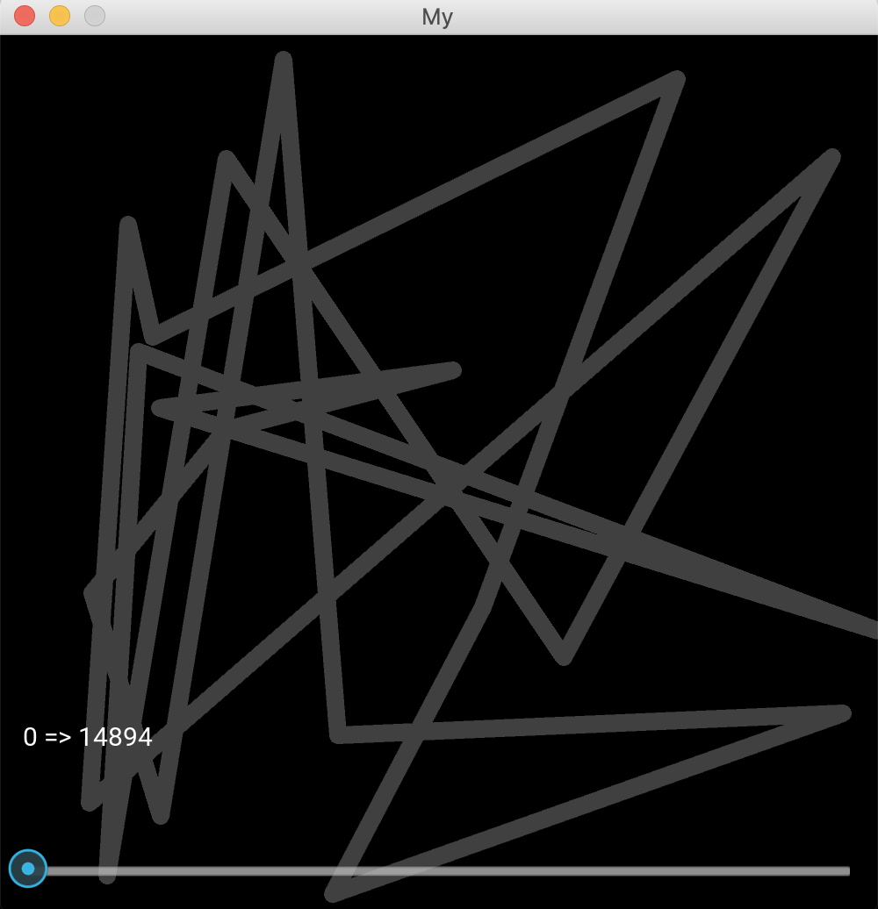
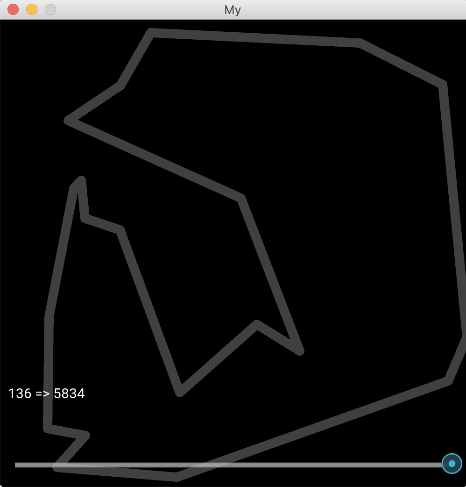

# Simulated Annealing in Python

Just an implementation (which can be easily subclassed) for the Simulated Annealing algorithm. More info: https://en.wikipedia.org/wiki/Simulated_annealing

I decided to implement the travelling salesman problem to test the implementation.

## About the functions

### `neighbour`

To pick a random neighbour, I decided to just swap two cities on the salesman path.

I've tested with swapping two successive cities on the path instead but the results were way worse (and taking way longer).

### Temperature `temperature`

I just needed a simple function where:

* 
* 
* fast initial decay

So I picked 

### Acceptance probabilities `acceptance_prob`

Simple pick:

* 1 if  e">
*  otherwise

### Energy (goal) function `energy`

Just the total distance walked for a given itinerary.

## Kivy for the GUI

I just kept it simple. There's a history and a slider to allow for replaying.

## Improvements

* Tweeking the numbers and formulas, obviously
* Generating a new set of random cities from the GUI, not by restarting the program.
* Maybe a random seed input field, for replayability (good to test and improve some bottlenecks)
* Better file and classes organization
